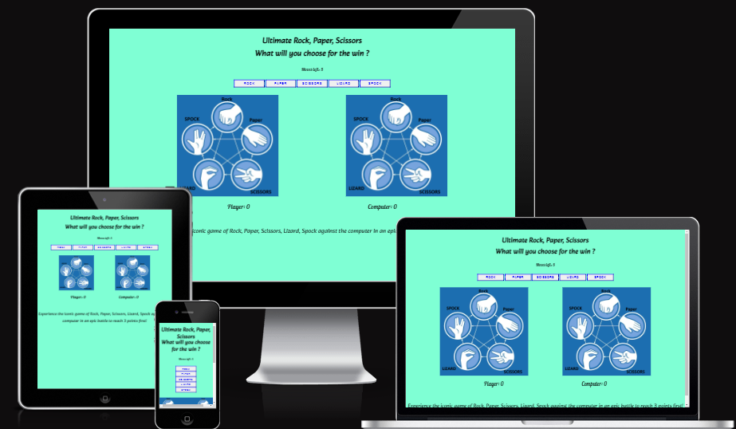
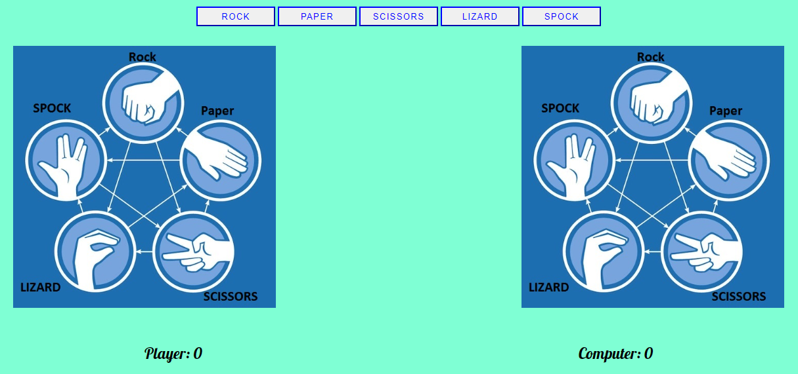
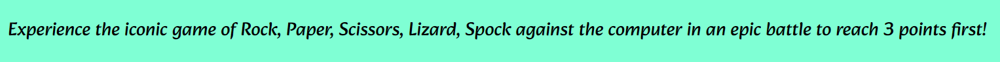
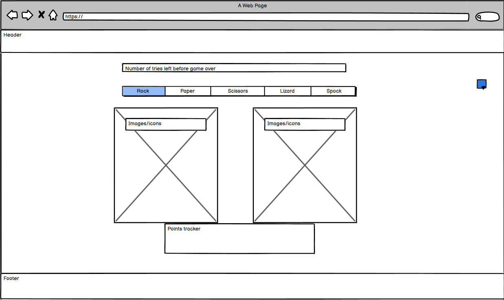

# Ultimate Rock;paper,Scissors
<h2 align="center"></h2>

## Project goal
This website focuses on letting the user enjoy a thrilling game of rock, paper, scissors, lizard, Spock against the computer as many time as they want.

### The live website can be found [here](https://oxyotl.github.io/Project-potrfolio-2/)

# Lists of contents 
 - Header
 - Countdown area
 - Game area
     - Control area
     - Images area
     - Score area
 - Footer
 - Wireframe
 - Testing
 - Deployment
 - Credits
    - Code
    - Media
    - Acknowledgements

## Header
It represents the title of the website and its goal is to catch the attention of the user and keep him on the pagr to play more rounds of the game, especially with the catchy font of the text.
<h2 align="center"></h2>

## Countdown area
Shows the user how many moves are left before the game is finished through a JavaScript function that updates after each move.
<h2 align="center"></h2>

## Game area
This is the main part of the website , dived into three areas, each with a specific function in tha game:
<h2 align="center"></h2>

- ### Control Area
    It holds the buttons for the user to press for start playing the game, each button represent one of the possible hand gestures that one could make when playing rock, paper, scissors, lizard, spock.
- ### Images area
    Inside, when the page is opened, this area shows two set of the rules of the game. After the user has made a choice the two change becoming respectively the user choice and the compuer.
- ### Score area 
    In this area are two spans that update after aech round of the game and keep track of the scores of both player and computer.

## Footer
In the footer there's only one string of test that explain the objective of the game.
<h2 align="center"></h2>

## Wireframe
With the wireframe it is possible to take a look at the basic idea of the webpage
<h2 align="center"></h2>

## Features

## Testing
- No errors found, only a few warnings reagarding the absence of an h2-h6, but it was a developer choice[W3C validator](https://validator.w3.org) 
- NO errors found when using [Jigsaw validator](https://jigsaw.w3.org/css-validator/)
-  errors found when using [JSHint](https://jshint.com/)

## Deployment
- The site was deployed to GitHub pages. The steps to deploy are as follows:
    - Log in to GitHub and locate the GitHub Repository
    - At the top of the Repository, locate the "Settings" Button on the menu.
    - Scroll down the Settings page until you locate the "Pages" Section.
    - Under "Branch", click the dropdown called "None" and select "main".
    - Refresh the page and you should be able to click on the site link.
    
## Credits

- ### Code
    - All code was written by the developer.
    - The external fonts come from [Google Fonts](https://fonts.google.com/)
- ### Media
    - The images are taken from [Steam Workshop](https://steamcommunity.com/sharedfiles/filedetails/?id=798194678)
- ### Acknowledgements
    - My Mentor, he really helped me  and guided my work.